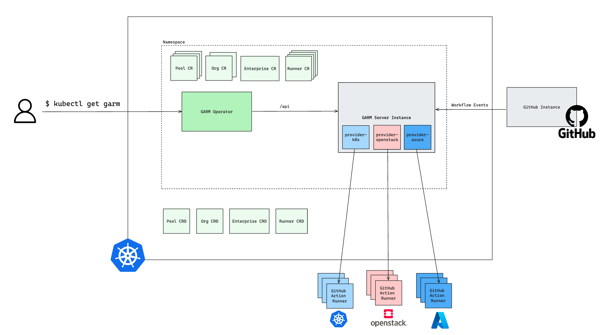

<!-- SPDX-License-Identifier: MIT -->

[](https://goreportcard.com/report/github.com/mercedes-benz/garm-operator) 

[](https://github.com/mercedes-benz/garm-operator/actions/workflows/build.yml)
[](https://scorecard.dev/viewer/?uri=github.com/mercedes-benz/garm-operator)

> [!NOTE]
> We are currently in the preparation phase to transfer the `garm-operator` to the [Cloudbase](https://github.com/cloudbase) organization. That means, that we will create one last release under the `mercedes-benz` organization and then transfer the repository. After the transfer, all future releases will be done under the `cloudbase` organization. Any further improvements to the operator will be done after the transfer.

# garm-operator 

<!-- toc -->
- [✨ What is the <code>garm-operator</code>?](#-what-is-the-garm-operator)
- [🔀 Versioning](#-versioning)
  - [Garm Version](#garm-version)
  - [Kubernetes Version](#kubernetes-version)
- [🚀 Installation](#-installation)
  - [Prerequisites](#prerequisites)
  - [Deployment](#deployment)
- [💻 Development](#-development)
- [📋 ADRs](#-adrs)
- [Contributing](#contributing)
- [Code of Conduct](#code-of-conduct)
- [License](#license)
- [Provider Information](#provider-information)
<!-- /toc -->


## ✨ What is the `garm-operator`?

`garm-operator` is a [Kubernetes®](https://kubernetes.io) operator that manages the lifecycle of [garm](https://github.com/cloudbase/garm) objects by creating/updating/deleting corresponding objects in the Kubernetes cluster.



## 🔀 Versioning

### Garm Version

`garm-operator` is tightly coupled with the `garm` server. Therefore, the compatibility between `garm-operator` and `garm` is crucial.

| garm-operator | garm    | compatible                                                                                                                                                   |
|---------------|---------|--------------------------------------------------------------------------------------------------------------------------------------------------------------|
| `0.4.x`       | `0.1.5` | :white_check_mark:                                                                                                                                           |
| `0.4.x`       | `0.1.4` | :x:                                                                                                                                                          |
| `0.3.x`       | `0.1.4` | :white_check_mark:                                                                                                                                           |
| `0.3.x`       | `0.1.5` | :warning: It is not recommended to operate during a longer time period. This state mostly exists when you update the `garm-operator` from `0.3.x` to `0.4.x` |

> [!NOTE] 
> please also read the [operator update guide](docs/operator_update.md) when you want to update the `garm-operator`.

### Kubernetes Version

garm-operator uses [`client-go`](https://github.com/kubernetes/client-go) to talk with
Kubernetes clusters. The supported Kubernetes cluster version is determined by `client-go`.
The compatibility matrix for client-go and Kubernetes cluster can be found
[here](https://github.com/kubernetes/client-go#compatibility-matrix).

## 🚀 Installation

### Prerequisites

1. A Kubernetes cluster you want to deploy the `garm-operator`.
1. As we use `ValidatingWebhooks` for validation, `cert-manager` must be installed. (You can find the installation instructions [here](https://cert-manager.io/docs/installation/)).
1. You need to have a `garm` server up and running and reachable from within the Kubernetes cluster you want to deploy the `garm-operator`.

### Deployment

#### `garm-operator`

We are releasing the `garm-operator` as container image together with the corresponding Kubernetes manifests. You can find the latest release [here](https://github.com/mercedes-benz/garm-operator/releases).

This manifests can be used to deploy the `garm-operator` into your Kubernetes cluster.

```bash
export GARM_OPERATOR_VERSION=<garm-operator-version>
export GARM_SERVER_URL=<garm-server-url> 
export GARM_SERVER_USERNAME=<garm-server-username>
export GARM_SERVER_PASSWORD=<garm-server-password>
export OPERATOR_WATCH_NAMESPACE=<operator-watch-namespace>
curl -L https://github.com/mercedes-benz/garm-operator/releases/download/${GARM_OPERATOR_VERSION}/garm-operator-all.yaml | envsubst | kubectl apply -f -
```

The full configuration parsing documentation can be found in the [configuration parsing guide](./docs/config/configuration-parsing.md)

#### Custom Resources

The CRD documentation can be also seen via [docs.crds.dev](https://doc.crds.dev/github.com/mercedes-benz/garm-operator).

Folder `config/samples` contains few basic examples of `Pools`, `Images` and corresponding `Repositories`, `Organizations` or `Enterprises`.

## 💻 Development

For local development, please read the [development guide](DEVELOPMENT.md).

## 📋 ADRs

To make some assumptions and corresponding decisions transparent, we use ADRs (Architecture Decision Records) to document them.

All ADRs can be found [here](docs/architectural-decision-records.md).

## Contributing

We welcome any contributions.
If you want to contribute to this project, please read the [contributing guide](CONTRIBUTING.md).

## Code of Conduct

Please read our [Code of Conduct](https://github.com/mercedes-benz/foss/blob/master/CODE_OF_CONDUCT.md) as it is our base for interaction.

## License

This project is licensed under the [MIT LICENSE](LICENSE).

## Provider Information

Please visit <https://www.mercedes-benz-techinnovation.com/en/imprint/> for information on the provider.

Notice: Before you use the program in productive use, please take all necessary precautions,
e.g. testing and verifying the program with regard to your specific use.
The program was tested solely for our own use cases, which might differ from yours.
