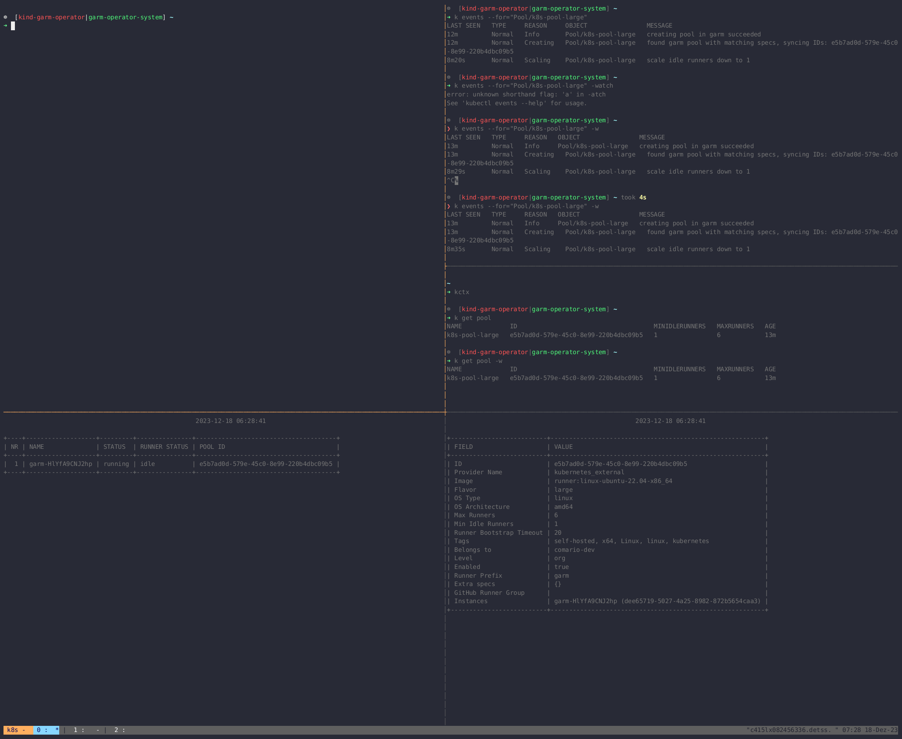

<!-- SPDX-License-Identifier: MIT -->

# Documentation

<!-- toc -->
- [Quickstart](#quickstart)
- [how to](#how-to)
  - [scale runners](#scale-runners)
  - [pause reconciliation](#pause-reconciliation)
<!-- /toc -->

## Quickstart

[Quickstart](quickstart.md) contains a walk-through of how to get started with `garm-operator`.

## how to

### scale runners

To scale the number of runners, there are two fields in the `pool.spec` which has take into account - `minIdleRunners` and `maxRunners`.

`maxRunners` defines the maximum number of runners which can be created in the pool. This number can be changed at any time.

`minIdleRunners` defines the minimum number of runners which should be available in the pool. This number can be changed at any time. `minIdleRunners` can not be greater than `maxRunners`.

#### scaling with `garm-operator`

Scaling in terms of `garm-operator` means to change the `minIdleRunners` field of a `pool` object.
This can be done by either editing the `pool.spec` or directly call the scaling the Kubernetes `scale` subresource of the `pool` object.

Scaling a `garm` pool can be done the same way as you are already able to scale a `Deployment` by using the build in support of `kubectl`:

```bash
kubectl scale pool my-pool --replicas=6
```



##### scaling up

If the previous configured value for `minIdleRunners` was set to `4` and we scaled up to `6`, `garm-operator` will make
an API call towards the garm-server where the `minIdleRunners` field is set to `6`.

Garm will take care of this request and will create the missing runners to fulfill the `minIdleRunners` requirement.

##### scaling down

Scaling down the number of runners is done by decreasing the `minIdleRunners` field. If we wan't to scale down from `6` to `4`,
`garm-operator` will make the same API call towards the garm-server where the `minIdleRunners` field is set to `4`.

As garm doesn't remove any idle runners (by design), the `garm-operator` will make another API call towards the garm-server,
where it get the current number of idle runners and will remove the difference between the current number of idle runners and the new `minIdleRunners` value.

### pause reconciliation

In some cases, you may want to pause the reconciliation for a specific object.
This can be done by adding the annotation `garm-operator.mercedes-benz.com/paused=true` to the object.

If the annotation is present, the controller will not reconcile the object and you are able to change the object on a `garm` side without the controller reverting your changes.

#### set the annotation

```bash
$ kubectl annotate organization developer-org garm-operator.mercedes-benz.com/paused=true

organization.garm-operator.mercedes-benz.com/developer-org annotate
```

Once the annotation is set, following log message will appear in the controller log:

```
I0822 04:20:20.668789       1 organization_controller.go:74]  "msg"="Reconciliation is paused for this object" "Organization"={"name":"developer-org","namespace":"garm-operator-system"} "controller"="organization" "controllerGroup"="garm-operator.mercedes-benz.com" "controllerKind"="Organization" "name"="developer-org" "namespace"="garm-operator-system" "reconcileID"="e1737a64-b4c6-4957-b4ee-def597c215b0"
```

#### unset the annotation

To resume the reconciliation, you need to remove the annotation from the object by running:

```bash
$ kubectl annotate organization developer-org garm-operator.mercedes-benz.com/paused-

organization.garm-operator.mercedes-benz.com/developer-org annotate
```
